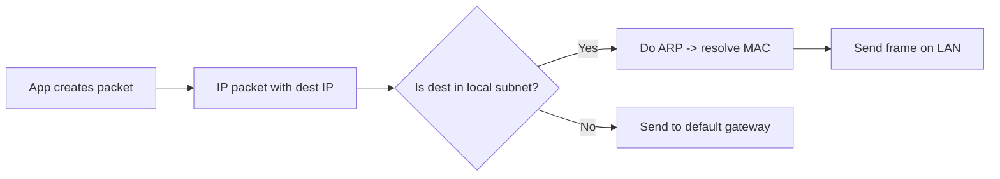
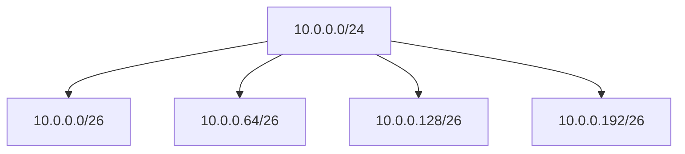
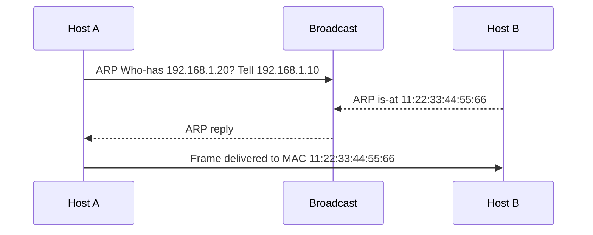
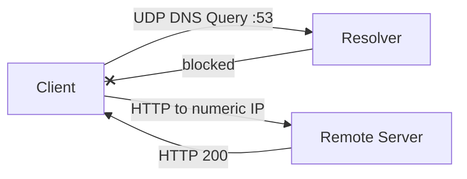
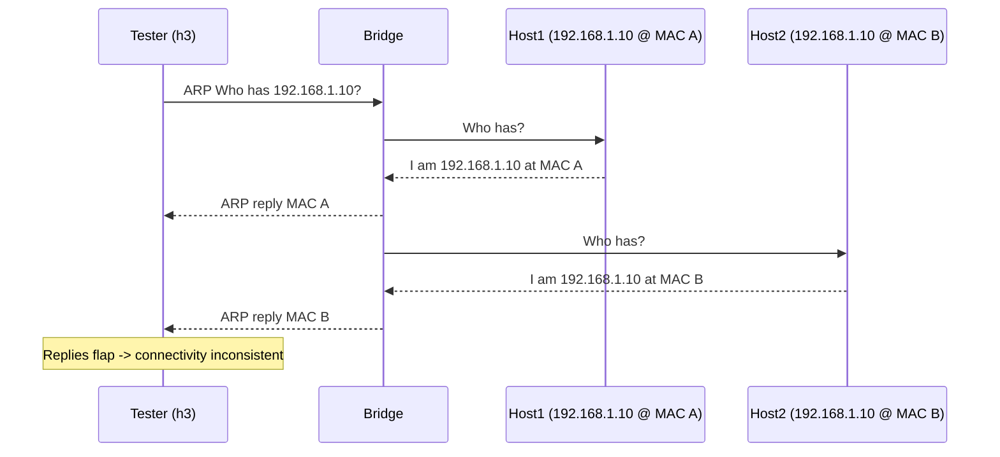
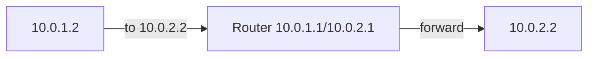
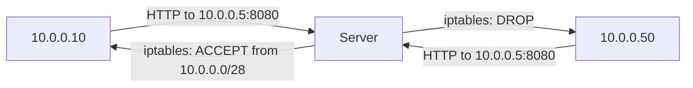
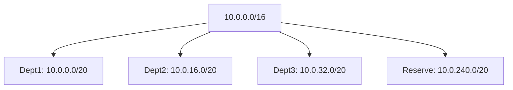

---

# Day 15 — Linux Networking Challenges (Daily DevOps + SRE Challenge Series — Season 2)

---

## Introduction

Welcome to Day 15 of the Daily DevOps + SRE Challenge Series – Season 2! 🎉

Today, you’ll dive into essential **Linux networking skills** through practical, story-based scenarios. You’ll configure IP addresses, set up namespaces, simulate routing, and debug traffic issues—all on your local machine without any complex setup. By the end, you’ll:

* Understand and troubleshoot the **OSI & TCP/IP layers** in real-world failures.
* Configure **IPv4/IPv6 addressing**, resolve subnetting conflicts, and simulate enterprise VPC designs.
* Master **ARP behavior**, from cache flushing to spoofing attacks.
* Gain hands-on skills to debug outages with tools like `iptables`, `ip`, and `tcpdump`.

---

## Why This Matters?

Networking is the backbone of everything—cloud apps, Kubernetes clusters, even CI/CD pipelines. If you can’t debug connectivity, you’ll get stuck in outages fast.

* **Real-World Edge:** Most outages aren’t due to servers crashing—they’re due to misconfigured routes, DNS failures, or firewall issues.
* **SRE Superpower:** Knowing the **why ping works but app fails** scenario makes you 10x faster in production war rooms.
* **Cloud Readiness:** VPC, subnets, and dual-stack IPv4/IPv6 configs are daily tasks for AWS/GCP/Azure engineers.
* **Interview Gold:** “Why can two hosts ping but not load HTTP?” or “How do you debug duplicate IP conflicts?”—classic SRE questions.
* **Security Awareness:** ARP spoofing and wrong subnet masks are real threats in production, not just lab theory.

---

## Real-World Save 🌍

At a fintech startup, payments randomly failed for EU customers. Engineers could **ping servers but HTTP calls kept timing out**. Debugging revealed a firewall rule blocking port 443 on just one subnet. Fixing that restored global transactions. Knowing **layer-by-layer troubleshooting** saved millions in lost revenue.

---

# Theory (detailed) — **do not skip**

> Below: full theory for the four topics you asked for. Read fully before doing labs.

---

## OSI & TCP/IP Models — Introduction

**What is it?**
OSI (Open Systems Interconnection) is a conceptual 7-layer model that describes how data moves through networked systems. TCP/IP model is a simpler practical model used in the Internet (4 layers). These help you think logically about where failures happen.

**Why learn it?**
Because when something breaks (web app not loading, DNS failing, packets dropping), you must ask: *which layer broke?* — physical, link (MAC), IP (routing), TCP/UDP (ports), or the app (HTTP/DNS). This narrows down troubleshooting steps.

---

### OSI layers (simple, one-line each)

1. **Physical (L1)** — cables, radio waves, NIC hardware.
2. **Data Link (L2)** — frames, MAC addresses, switches, ARP.
3. **Network (L3)** — IP addressing and routing.
4. **Transport (L4)** — TCP/UDP, ports, connection reliability.
5. **Session (L5)** — sessions, dialogs (rarely directly debugged).
6. **Presentation (L6)** — encoding/encryption (TLS sits around here).
7. **Application (L7)** — HTTP, DNS, SSH—the services users interact with.

**TCP/IP Stack mapping (practical):**

* Link (L1–L2) — ARP, Ethernet
* Internet (L3) — IP, routing
* Transport (L4) — TCP, UDP
* Application (L7) — HTTP, DNS, SSH

---

### Key concepts & simple analogies

* **IP = house number** — tells you *where* to go.
* **MAC = person’s face** — used to deliver inside the same building (LAN).
* **Ports (TCP/UDP) = apartment door numbers** — same house, many services.
* **Firewall = security guard at door** — can block specific ports/protocols.

---

### Typical tools & what they tell you

* `ping` (ICMP) → L3 reachability test.
* `arp` / `ip neigh` → L2 IP→MAC mapping.
* `ip addr`, `ip route` → addresses & routes (L3).
* `ss -tuln` / `nc` → ports and services (L4).
* `tcpdump` → raw packet capture (L2–L4).
* `iptables` or `nft` → firewall rules (L4-L3 policies).
* `traceroute` → shows path (L3/hops), but depends on ICMP/TCP/UDP responses.

---

### Troubleshooting mental model (simple process)

1. **Is the NIC up?** (`ip link`) — Physical/L1
2. **Can I reach IP?** (`ping`) — Network/L3
3. **Is the service listening?** (`ss -ltnp`, `nc`) — Transport/L4 & App/L7
4. **Is DNS resolving?** (`dig`, `nslookup`) — App/L7
5. **Capture packets** (`tcpdump`) — inspect headers (MAC, IP, TCP flags).
6. **Check firewall rules** (`iptables -L`, `nft list ruleset`).

---

### Mermaid diagrams (OSI / TCP-IP overview)

OSI stack:

```mermaid
graph TB
A[Application (HTTP/DNS/SSH)] --> B[Transport (TCP/UDP)]
B --> C[Network (IP/Routing)]
C --> D[Data Link (Ethernet/ARP)]
D --> E[Physical (Cable/Wireless)]
```

Packet debugging flow:


---

## IP Addressing (IPv4 & IPv6) — Introduction

**What is it?**
IP addresses uniquely identify hosts on a network. IPv4 is 32-bit (e.g., `192.168.1.10`), IPv6 is 128-bit (e.g., `2001:db8::1`).

**Why important?**
If you don’t know addressing basics, you’ll misconfigure masks, gateways, or try to reach the wrong network. IP addressing also affects routing, ACLs, NAT — everything SREs care about.

---

### IPv4 basics

* **Format:** dotted decimal `a.b.c.d` (32 bits).
* **CIDR prefix:** `/24` means top 24 bits are network — addresses inside are on same subnet.
* **Private ranges:**

  * `10.0.0.0/8`
  * `172.16.0.0/12`
  * `192.168.0.0/16`
* **Special addresses:** `0.0.0.0` (this host), `127.0.0.1` (loopback), network & broadcast addresses.

**How to compute host counts:**

* `/24` → 256 addresses (254 hosts usable).
* `/26` → 64 addresses (62 hosts usable).

---

### IPv6 basics

* **Format:** hex groups `2001:db8::1` (128 bits).
* **Scopes:** Link-local (`fe80::/10`), global unicast (public), loopback (`::1`).
* **Advantages:** large address space, simpler auto-configuration (SLAAC), better routing aggregation.

---

### Subnet mask & network boundary (simple)

* Mask tells whether destination IP is on your local network or needs to be sent to a router.
* Example: `192.168.1.10/24` and `192.168.1.20/24` are local; `192.168.2.1` is remote.

---

### Useful commands

* Show addresses: `ip addr show`
* Show routes: `ip route show`
* Add address: `ip addr add 10.0.0.2/24 dev eth0`
* IPv6 show: `ip -6 addr show`
* Disable IPv4 (namespace): `sysctl -w net.ipv4.conf.all.disable_ipv4=1`

---

### Mermaid: Routing decision (simple)



---

## Subnetting & CIDR — Introduction

**What is it?**
CIDR (Classless Inter-Domain Routing) describes networks by prefix length (`/24`, `/26`) and enables flexible splitting of IP space. Subnetting divides a big network into smaller networks.

**Why learn it?**
To allocate IPs to teams, limit broadcast domains, design VPCs, and avoid overlaps when merging networks.

---

### How CIDR works (simple)

* `10.0.0.0/24` → addresses `10.0.0.0`–`10.0.0.255`.
* Splitting `10.0.0.0/24` into `/26` yields:

  * `10.0.0.0/26` (0–63)
  * `10.0.0.64/26` (64–127)
  * `10.0.0.128/26` (128–191)
  * `10.0.0.192/26` (192–255)

---

### Common tasks

* **Divide network** for teams → use /26, /27 etc.
* **Plan VPC** blocks to avoid future overlap.
* **Detect overlaps** before merging nets.

---

### Overlap problems (simple)

* If Net A thinks IP is local (on-link) and Net B thinks same IP is remote, packets can be dropped or blackholed. The fix: **renumber** or **NAT** at boundary.

---

### Mermaid: Subnet split



---

## ARP (Address Resolution Protocol) — Introduction

**What is it?**
ARP maps IPv4 addresses to MAC addresses inside a LAN. It’s how IP packets get delivered to the correct NIC inside the same broadcast domain.

**Why ARP matters?**
If ARP is wrong or spoofed, your traffic can go to the wrong machine, be dropped, or be intercepted.

---

### ARP normal flow (simple)

1. Host A wants to send to IP X.
2. If it has no MAC for X in ARP cache, it sends **ARP Who-has X tell A** (broadcast).
3. The owner replies **ARP is-at MAC**.
4. Host A caches and sends frames to that MAC.

---

### ARP cache and states

* Entries expire — kernel keeps freshness flags (`REACHABLE`, `STALE`, etc.).
* Commands: `ip neigh show`, `arp -n`, `arping -I <iface> <ip>`

---

### ARP security problems

* **Duplicate IP:** Two hosts claim same IP → flapping / inconsistent replies.
* **ARP spoofing/poisoning:** Attacker sends fake ARP replies linking victim/gateway IP to attacker’s MAC → MITM.
* **Mitigations:** static ARP entries (for critical hosts), switch DAI, encryption (TLS).

---

### Mermaid: ARP sequence



---

# Now — Challenges (exactly as you provided)

> From here on, I paste **your whole challenge set verbatim** (I did not change or remove anything). After each challenge block I add a **Mermaid flow diagram** and a short **mapping note** showing packet travel, where it breaks, and where to fix it.

---

---

## Introduction

Welcome to Day 15 of the Daily DevOps + SRE Challenge Series – Season 2! 🎉

Today, you’ll dive into essential **Linux networking skills** through practical, story-based scenarios. You’ll configure IP addresses, set up namespaces, simulate routing, and debug traffic issues—all on your local machine without any complex setup. By the end, you’ll:

* Understand and troubleshoot the **OSI & TCP/IP layers** in real-world failures.
* Configure **IPv4/IPv6 addressing**, resolve subnetting conflicts, and simulate enterprise VPC designs.
* Master **ARP behavior**, from cache flushing to spoofing attacks.
* Gain hands-on skills to debug outages with tools like iptables, ip, and tcpdump.

---

## Why This Matters?

Networking is the backbone of everything—cloud apps, Kubernetes clusters, even CI/CD pipelines. If you can’t debug connectivity, you’ll get stuck in outages fast.

* **Real-World Edge:** Most outages aren’t due to servers crashing—they’re due to misconfigured routes, DNS failures, or firewall issues.
* **SRE Superpower:** Knowing the **why ping works but app fails** scenario makes you 10x faster in production war rooms.
* **Cloud Readiness:** VPC, subnets, and dual-stack IPv4/IPv6 configs are daily tasks for AWS/GCP/Azure engineers.
* **Interview Gold:** “Why can two hosts ping but not load HTTP?” or “How do you debug duplicate IP conflicts?”—classic SRE questions.
* **Security Awareness:** ARP spoofing and wrong subnet masks are real threats in production, not just lab theory.

---

## Real-World Save 🌍

At a fintech startup, payments randomly failed for EU customers. Engineers could **ping servers but HTTP calls kept timing out**. Debugging revealed a firewall rule blocking port 443 on just one subnet. Fixing that restored global transactions. Knowing **layer-by-layer troubleshooting** saved millions in lost revenue.

---

## Challenges

🔹 **1. OSI & TCP/IP Models**

**Ping works, but HTTP fails**
Run python3 -m http.server 8080 in one namespace/VM.
From another, ping works but block TCP port 8080 using iptables.
👉 Mimics: “Why I can ping the server but the website isn’t loading?”

**Solution:**

```bash
# Setup
ip netns add srv; ip netns add cli
ip link add veth-s type veth peer name veth-c
ip link set veth-s netns srv; ip link set veth-c netns cli
ip netns exec srv ip addr add 10.0.0.1/24 dev veth-s
ip netns exec cli ip addr add 10.0.0.2/24 dev veth-c
ip netns exec srv ip link set veth-s up; ip netns exec cli ip link set veth-c up
ip netns exec srv python3 -m http.server 8080 &

# Test
ip netns exec cli ping -c2 10.0.0.1           # ✅ works
ip netns exec cli curl -m3 10.0.0.1:8080      # ✅ works

# Break (block TCP/8080)
ip netns exec srv iptables -A INPUT -p tcp --dport 8080 -j DROP
ip netns exec cli curl -m3 10.0.0.1:8080      # ❌ timeout

# Interpretation: L3 OK; L4/L7 blocked by firewall.
# Fix
ip netns exec srv iptables -D INPUT -p tcp --dport 8080 -j DROP
```

**Flow diagram (packet journey → break → fix):**

```mermaid
flowchart LR
C[Client] -->|ICMP Echo Request| S[Server]
S -->|ICMP Echo Reply| C
note right of S: ICMP works (L3)

C -->|TCP SYN :8080| S
S -->|iptables DROP| C
note right of S: TCP blocked at server (L4)

C -->|Fix: iptables -D ...| S
S -->|TCP SYN/ACK| C
C -->|HTTP GET| S
S -->|HTTP 200| C
```

*Note:* ping uses ICMP (L3). curl uses TCP (L4) + HTTP (L7). iptables blocked TCP/8080 — that's why ping succeeded but web failed.

---

**DNS Layer Check**
Disable /etc/resolv.conf or block UDP 53.
Test browsing (curl google.com fails, but curl 142.250.182.14 works).
👉 Mimics: “App fails because DNS is misconfigured.”

**Solution:**

```bash
# Setup one namespace as client
ip netns add ns1; ip netns exec ns1 ip link set lo up

# Break DNS safely (in namespace only)
ip netns exec ns1 iptables -A OUTPUT -p udp --dport 53 -j DROP

# Test
ip netns exec ns1 curl -m3 http://google.com        # ❌ fails (could not resolve)
ip netns exec ns1 curl -m3 http://142.250.182.14    # ✅ works (direct IP)

# Interpretation: IP path fine; DNS resolution broken.
# Fix
ip netns exec ns1 iptables -D OUTPUT -p udp --dport 53 -j DROP
```

**Flow diagram:**



*Note:* block DNS (UDP/53) prevents name resolution; direct IP works.

---

**MTU Mismatch**
Set MTU on one interface to 1400 and the other to 900.
Try large file transfer with scp.
👉 Mimics: “Packets drop due to MTU mismatch in VPN tunnels.”

**Solution:**

```bash
# Setup
ip netns add a; ip netns add b
ip link add va type veth peer name vb
ip link set va netns a; ip link set vb netns b
ip netns exec a ip addr add 10.1.1.1/24 dev va
ip netns exec b ip addr add 10.1.1.2/24 dev vb
ip netns exec a ip link set va up mtu 1400
ip netns exec b ip link set vb up mtu 900

# Test small vs large
ip netns exec a ping -c2 10.1.1.2                 # ✅ often works
ip netns exec a ping -M do -s 1200 10.1.1.2       # ❌ fails due to MTU

# (Optional TCP test)
ip netns exec b nc -l -p 9000 >/dev/null &
head -c 200000 </dev/urandom | ip netns exec a nc 10.1.1.2 9000   # may stall

# Interpretation: PMTU/fragmentation issue.
# Fix (align MTUs)
ip netns exec b ip link set vb mtu 1400
```

**Flow diagram:**

```mermaid
flowchart LR
C[Client mtu=1400] -->|Large IP packet| Link[Link mtu=900]
Link --x|can't forward| Router[drop or ICMP]
Router -->|ICMP frag needed| C
note right of Router: if ICMP blocked -> no PMTUD -> TCP stalls
C -->|Fix: align MTU| Link
```

---

**Layer 2 vs Layer 3 Failure**
Assign two machines same subnet but no switch/bridge between them.
👉 Mimics: “Why hosts on same subnet can’t reach each other?”

**Solution:**

```bash
# Setup (two separate links with no shared L2 domain)
ip netns add n1; ip netns add n2
ip link add v1 type veth peer name v1p
ip link add v2 type veth peer name v2p
ip link set v1 netns n1; ip link set v2 netns n2
ip netns exec n1 ip addr add 192.168.50.1/24 dev v1
ip netns exec n2 ip addr add 192.168.50.2/24 dev v2
ip netns exec n1 ip link set v1 up; ip netns exec n2 ip link set v2 up

# Test
ip netns exec n1 ping -c2 192.168.50.2    # ❌ fails (no L2 connectivity)

# Interpretation: Same subnet needs shared L2 (bridge/switch).
# Fix: create bridge and attach peers (host side v1p & v2p)
ip link add br0 type bridge; ip link set br0 up
ip link set v1p master br0; ip link set v2p master br0
ip netns exec n1 ping -c2 192.168.50.2    # ✅ works now
```

**Flow diagram:**

```mermaid
flowchart LR
A[Host A] -->|ARP Who-has| None[No shared L2 domain]
None --x--> B[Host B]
note right of None: ARP doesn't reach -> can't resolve MAC
A -->|Fix: add bridge| BR[Bridge]
BR --> B
```

---

**Layer-wise Debugging**
Capture traffic with tcpdump. Try ICMP, TCP, UDP one by one.
👉 Helps visualize OSI/TCP-IP model in action.

**Solution:**

```bash
# Setup two namespaces
ip netns add c1; ip netns add c2
ip link add t1 type veth peer name t2
ip link set t1 netns c1; ip link set t2 netns c2
ip netns exec c1 ip addr add 10.9.0.1/24 dev t1
ip netns exec c2 ip addr add 10.9.0.2/24 dev t2
ip netns exec c1 ip link set t1 up; ip netns exec c2 ip link set t2 up

# Start capture on c2
ip netns exec c2 tcpdump -i t2 -n &

# Generate traffic from c1
ip netns exec c1 ping -c2 10.9.0.2                 # ICMP
ip netns exec c2 python3 -m http.server 8081 &     # TCP server
ip netns exec c1 curl -m3 10.9.0.2:8081            # TCP
ip netns exec c1 sh -lc 'echo hi | nc -u 10.9.0.2 9001'  # UDP

# Interpretation: See L2 (eth), L3 (IP), L4 (ICMP/TCP/UDP) in capture.
```

**Flow diagram (example capture view):**

```mermaid
flowchart LR
C[Client] -->|ICMP Echo| S[Server]
S -->|ICMP Reply| C
C -->|TCP SYN:8081| S
S --x|No SYN/ACK| C
note right of S: server might be down or firewall blocking
C -->|UDP packet| S
S -->|(no ACK required)| C
```

---

🔹 **2. IP Addressing (IPv4, IPv6)**

**Duplicate IP Conflict**
Assign 192.168.1.10 to two hosts. Ping from a third host → observe flapping replies.
👉 Mimics: “Two servers misconfigured with same IP.”

**Solution:**

```bash
# Setup three namespaces on a bridge
ip netns add h1; ip netns add h2; ip netns add h3
ip link add br0 type bridge; ip link set br0 up

# Connect h1
ip link add h1v type veth peer name h1p
ip link set h1v netns h1; ip link set h1p master br0
ip netns exec h1 ip addr add 192.168.1.10/24 dev h1v; ip netns exec h1 ip link set h1v up

# Connect h2
ip link add h2v type veth peer name h2p
ip link set h2v netns h2; ip link set h2p master br0
ip netns exec h2 ip addr add 192.168.1.10/24 dev h2v; ip netns exec h2 ip link set h2v up

# Connect h3
ip link add h3v type veth peer name h3p
ip link set h3v netns h3; ip link set h3p master br0
ip netns exec h3 ip addr add 192.168.1.30/24 dev h3v; ip netns exec h3 ip link set h3v up

# Test from h3
ip netns exec h3 arping -I h3v -c 3 192.168.1.10   # 🔁 multiple MACs/replies (flap)
ip netns exec h3 ping -c4 192.168.1.10             # ❗ inconsistent replies

# Interpretation: Duplicate IP causing ARP instability.
# Fix: give h2 a unique IP, e.g.
ip netns exec h2 ip addr flush dev h2v
ip netns exec h2 ip addr add 192.168.1.11/24 dev h2v
```

**Flow diagram:**



---

**IPv6 Only Network**
Assign IPv6 addresses only (`2001:db8::1/64`). Disable IPv4 → try reaching services.
👉 Mimics: “Transitioning to IPv6 in enterprise.”

**Solution:**

```bash
# Setup
ip netns add v6a; ip netns add v6b
ip link add v6aif type veth peer name v6bif
ip link set v6aif netns v6a; ip link set v6bif netns v6b
ip netns exec v6a ip -6 addr add 2001:db8::1/64 dev v6aif
ip netns exec v6b ip -6 addr add 2001:db8::2/64 dev v6bif
ip netns exec v6a ip link set v6aif up; ip netns exec v6b ip link set v6bif up

# Disable IPv4 on both interfaces
ip netns exec v6a sysctl -w net.ipv4.conf.all.disable_ipv4=1
ip netns exec v6b sysctl -w net.ipv4.conf.all.disable_ipv4=1

# Test IPv6 reachability
ip netns exec v6a ping -6 -c2 2001:db8::2        # ✅ works
# Try reaching an IPv4-only IP from v6a (will fail)
ip netns exec v6a ping -6 -c2 142.250.182.14     # ❌ cannot (v4 only target)

# Interpretation: IPv6-only cannot reach IPv4-only services.
# Fix: deploy dual-stack or NAT64/DNS64.
```

**Flow diagram:**

```mermaid
flowchart LR
A[IPv6-only Host] -->|IPv6 packet| B[IPv6 Server] -->|reply| A
A -->|tries IPv4 address| C[IPv4-only Server]
C --x|No route| A
note right of C: IPv4 address unreachable from IPv6-only host without translator
```

---

**Wrong Subnet Mask**
Host A: 192.168.1.10/24, Host B: 192.168.1.20/16. Traffic works one way but not the other.
👉 Mimics: “Subnet mask mismatch during manual config.”

**Solution:**

```bash
# Setup
ip netns add A; ip netns add B
ip link add av type veth peer name bv
ip link set av netns A; ip link set bv netns B
ip netns exec A ip addr add 192.168.1.10/24 dev av
ip netns exec B ip addr add 192.168.1.20/16 dev bv
ip netns exec A ip link set av up; ip netns exec B ip link set bv up

# Test both ways
ip netns exec A ping -c2 192.168.1.20    # may ❌ (A expects router)
ip netns exec B ping -c2 192.168.1.10    # may ✅ (B thinks on-link)

# Interpretation: Asymmetric routing due to mask mismatch.
# Fix: make both /24 or both /16 consistently.
```

**Flow diagram:**

```mermaid
flowchart LR
A[Host A 192.168.1.10/24] -->|Sees 192.168.1.20 as remote| GW[Gateway]
B[Host B 192.168.1.20/16] -->|Sees 192.168.1.10 as local| A
A -->|send via gateway| X[not delivered]
B -->|ARP| A -->|reply| B
Note over A,B: Asymmetric -> fix masks
```

---

**Multiple NICs Routing**
One host with 192.168.1.10 (LAN) and 10.0.0.10 (WAN). Configure routing → see which NIC is chosen.
👉 Mimics: “Multi-homed servers with wrong default gateway.”

**Solution:**

```bash
# Setup one namespace with two NICs via two bridges
ip netns add mh
ip link add br1 type bridge; ip link set br1 up
ip link add br2 type bridge; ip link set br2 up

ip link add mhv1 type veth peer name tap1
ip link add mhv2 type veth peer name tap2
ip link set mhv1 netns mh; ip link set mhv2 netns mh
ip link set tap1 master br1; ip link set tap2 master br2
ip netns exec mh ip addr add 192.168.1.10/24 dev mhv1
ip netns exec mh ip addr add 10.0.0.10/24 dev mhv2
ip netns exec mh ip link set mhv1 up; ip netns exec mh ip link set mhv2 up

# Default route selection
ip netns exec mh ip route add default via 10.0.0.1 dev mhv2 metric 100
ip netns exec mh ip route add default via 192.168.1.1 dev mhv1 metric 200
ip netns exec mh ip route show

# Policy routing example (force source-based egress)
ip netns exec mh ip rule add from 192.168.1.10/32 table 1
ip netns exec mh ip route add default via 192.168.1.1 dev mhv1 table 1
```

**Interpretation:** Lower metric wins; use policy routing to pin traffic per source. **Fix:** Correct default gateway or add ip rule/tables.

**Flow diagram:**

```mermaid
flowchart LR
A[Host with NIC1 192.168.1.10] -->|Default via 192.168.1.1 (metric 200)| GW1
A -->|Default via 10.0.0.1 (metric 100)| GW2
note right of A: metric 100 chosen -> uses GW2
A -->|Fix: ip rule for source 192.168.1.10| GW1
```

---

**IPv4 ↔ IPv6 Connectivity**
Try pinging an IPv4-only service from an IPv6-only host.
👉 Mimics: “Why dual-stack migration is tricky.”

**Solution:**

```bash
# Reuse IPv6-only ns from earlier
# Test IPv4 literal via IPv6 stack (will fail)
ip netns exec v6a ping -6 142.250.182.14    # ❌ cannot
```

**Interpretation:** Separate stacks; translation required. **Fix:** Provide dual-stack or NAT64/DNS64.

**Flow diagram:**

```mermaid
flowchart LR
A[IPv6-only host] -->|IPv6 packet| B[IPv6 path]
A --x|IPv4 target| C[IPv4 host]
note right of C: translation required (NAT64/DNS64) or dual-stack
```

---

🔹 **3. Subnetting & CIDR**

**Basic Subnet Split**
Take 10.0.0.0/24.
Create 4 subnets (/26) → assign to 4 namespaces.
👉 Mimics: “Dividing network for teams.”

**Solution:**

```bash
# Subnets: 10.0.0.0/26, 10.0.0.64/26, 10.0.0.128/26, 10.0.0.192/26
ip netns add t1; ip netns add t2; ip netns add t3; ip netns add t4
ip link add brs type bridge; ip link set brs up

# helper to attach each ns
for N in 1 2 3 4; do ip link add v$N type veth peer name p$N; done
ip link set p1 master brs; ip link set p2 master brs; ip link set p3 master brs; ip link set p4 master brs
ip link set v1 netns t1; ip link set v2 netns t2; ip link set v3 netns t3; ip link set v4 netns t4

ip netns exec t1 ip addr add 10.0.0.1/26 dev v1; ip netns exec t1 ip link set v1 up
ip netns exec t2 ip addr add 10.0.0.65/26 dev v2; ip netns exec t2 ip link set v2 up
ip netns exec t3 ip addr add 10.0.0.129/26 dev v3; ip netns exec t3 ip link set v3 up
ip netns exec t4 ip addr add 10.0.0.193/26 dev v4; ip netns exec t4 ip link set v4 up

# Test within same /26 only (others need router)
ip netns exec t1 ping -c2 10.0.0.2        # another host you'd add in same /26
```

**Interpretation:** Hosts in different /26s need routing.

**Flow diagram:**

```mermaid
graph TD
A[10.0.0.0/24] --> B[10.0.0.0/26 (Team1)]
A --> C[10.0.0.64/26 (Team2)]
A --> D[10.0.0.128/26 (Team3)]
A --> E[10.0.0.192/26 (Team4)]
Note right of B: cross /26 needs router
```

---

**Inter-Subnet Routing**
Setup ns1: 10.0.1.1/24, ns2: 10.0.2.1/24, router with two NICs.
Enable IP forwarding.
👉 Mimics: “Routers connecting branch offices.”

**Solution:**

```bash
ip netns add r; ip netns add n1; ip netns add n2
# veths r<->n1 and r<->n2
ip link add rn1 type veth peer name n1v
ip link add rn2 type veth peer name n2v
ip link set rn1 netns r; ip link set n1v netns n1
ip link set rn2 netns r; ip link set n2v netns n2

# IPs
ip netns exec r  ip addr add 10.0.1.1/24 dev rn1
ip netns exec n1 ip addr add 10.0.1.2/24 dev n1v
ip netns exec r  ip addr add 10.0.2.1/24 dev rn2
ip netns exec n2 ip addr add 10.0.2.2/24 dev n2v
ip netns exec r ip link set rn1 up; ip netns exec r ip link set rn2 up
ip netns exec n1 ip link set n1v up; ip netns exec n2 ip link set n2v up

# Enable routing on router
ip netns exec r sysctl -w net.ipv4.ip_forward=1

# Set default routes on n1/n2
ip netns exec n1 ip route add default via 10.0.1.1
ip netns exec n2 ip route add default via 10.0.2.1

# Test
ip netns exec n1 ping -c2 10.0.2.2          # ✅ via router
```

**Flow diagram:**



---

**Subnet Overlap Issue**
Setup ns1: 192.168.0.0/24, ns2: 192.168.0.0/16.
Try ping between them.
👉 Mimics: “Merging two companies with overlapping IP ranges.”

**Solution:**

```bash
ip netns add o1; ip netns add o2
ip link add ov1 type veth peer name ov2
ip link set ov1 netns o1; ip link set ov2 netns o2
ip netns exec o1 ip addr add 192.168.0.10/24 dev ov1
ip netns exec o2 ip addr add 192.168.0.20/16 dev ov2
ip netns exec o1 ip link set ov1 up; ip netns exec o2 ip link set ov2 up

# Test
ip netns exec o1 ping -c2 192.168.0.20      # inconsistent / fails when routing involved

# Interpretation: Overlap causes on-link vs routed mismatch -> blackholes.
# Fix: renumber one side. Temporary: NAT at the boundary.
```

**Flow diagram:**

```mermaid
flowchart LR
A[Net1: 192.168.0.0/24] -->|thinks IP local| H1[192.168.0.20]
B[Net2: 192.168.0.0/16] -->|thinks IP local| H2[192.168.0.20]
Note over A,B: Overlap -> inconsistent on-link decisions -> blackholes
Fix --> Renumber or NAT
```

---

**Restrict Access via CIDR**
Run service on one namespace.
Use iptables to allow only 10.0.0.0/28.
👉 Mimics: “Firewall rules allowing only specific subnets.”

**Solution:**

```bash
# Setup server and client
ip netns add s; ip netns add c1; ip netns add c2
ip link add brf type bridge; ip link set brf up

# connect three namespaces
for N in s c1 c2; do ip link add ${N}v type veth peer name ${N}p; done
ip link set sp master brf; ip link set c1p master brf; ip link set c2p master brf
ip link set sv netns s; ip link set c1v netns c1; ip link set c2v netns c2

# addresses: allow only 10.0.0.0/28 (i.e., 10.0.0.1–14)
ip netns exec s  ip addr add 10.0.0.5/24  dev sv;  ip netns exec s  ip link set sv up
ip netns exec c1 ip addr add 10.0.0.10/24 dev c1v; ip netns exec c1 ip link set c1v up   # allowed
ip netns exec c2 ip addr add 10.0.0.50/24 dev c2v; ip netns exec c2 ip link set c2v up   # blocked

# start service
ip netns exec s python3 -m http.server 8080 &

# firewall allow only /28
ip netns exec s iptables -A INPUT -p tcp --dport 8080 -s 10.0.0.0/28 -j ACCEPT
ip netns exec s iptables -A INPUT -p tcp --dport 8080 -j DROP

# Test
ip netns exec c1 curl -m3 10.0.0.5:8080    # ✅ allowed
ip netns exec c2 curl -m3 10.0.0.5:8080    # ❌ blocked

# Fix: adjust CIDR as needed or remove rule.
```

**Flow diagram:**



---

**VPC Planning Simulation**
Start with 10.0.0.0/16.
Subdivide for 10 departments.
👉 Mimics: “Cloud VPC CIDR allocation.”

**Solution (planning steps):**

```text
- Base: 10.0.0.0/16 (65536 IPs)
- Allocate /20 per department (4096 IPs each), contiguous blocks:
  Dept1: 10.0.0.0/20
  Dept2: 10.0.16.0/20
  Dept3: 10.0.32.0/20
  ...
  Dept10: 10.0.144.0/20
- Reserve 10.0.240.0/20 for shared services, 10.0.224.0/20 for transit/NAT.
- For prod/stage inside each /20:
  - Prod:   first /22 (e.g., 10.0.0.0/22)
  - Staging: next /23 (e.g., 10.0.4.0/23)
  - Dev:    next /23 (e.g., 10.0.6.0/23)
- Ensure no overlaps; document route tables/NACLs per CIDR.
```

**Interpretation:** Leaves room for growth, easy aggregation (`/16` → `/20` → `/22`).

**Flow diagram:**



---

🔹 **4. ARP**

**Basic ARP Resolution**
Setup 2 namespaces in same subnet. Ping once → check ip neigh show.
👉 Mimics: “How ARP table populates in real systems.”

**Solution:**

```bash
ip netns add a1; ip netns add a2
ip link add a1v type veth peer name a2v
ip link set a1v netns a1; ip link set a2v netns a2
ip netns exec a1 ip addr add 172.16.0.1/24 dev a1v
ip netns exec a2 ip addr add 172.16.0.2/24 dev a2v
ip netns exec a1 ip link set a1v up; ip netns exec a2 ip link set a2v up

ip netns exec a1 ping -c1 172.16.0.2
ip netns exec a1 ip neigh show 172.16.0.2      # shows MAC learned (REACHABLE)
```

**Flow diagram:**

```mermaid
sequenceDiagram
participant A as Host A (172.16.0.1)
participant B as Host B (172.16.0.2)
A->>B: ARP Who-has 172.16.0.2?
B-->>A: ARP is-at 11:22:33:44:55:66
A->>B: IP packet delivered to MAC 11:22:33:44:55:66
```

---

**Clear ARP Cache**
Delete entry: `ip neigh flush all`. Ping again → watch new ARP request.
👉 Mimics: “Network slow after cache invalidation.”

**Solution:**

```bash
ip netns exec a1 ip neigh flush all
ip netns exec a1 ip neigh show                 # empty/INCOMPLETE
ip netns exec a1 tcpdump -i a1v -n arp &       # watch ARP who-has
ip netns exec a1 ping -c1 172.16.0.2           # triggers fresh ARP
```

**Flow diagram:**

```mermaid
flowchart LR
A[Host A] -->|ARP who-has| B[Host B]
B -->|ARP is-at| A
```

---

**Wrong MAC Binding**
Add fake ARP entry: `ip neigh add 192.168.1.10 lladdr aa:bb:cc:dd:ee:ff dev veth0`. Ping → fails.
👉 Mimics: “Static ARP misconfig breaks traffic.”

**Solution (adapted to our ns/if names):**

```bash
# Inject wrong static ARP in a1 for a2
ip netns exec a1 ip neigh add 172.16.0.2 lladdr aa:bb:cc:dd:ee:ff dev a1v nud permanent
ip netns exec a1 ping -c1 172.16.0.2          # ❌ fails

# Fix
ip netns exec a1 ip neigh del 172.16.0.2 dev a1v
ip netns exec a1 ping -c1 172.16.0.2          # ✅ works again
```

**Flow diagram:**

```mermaid
flowchart LR
A[Host A] -->|send to MAC aa:bb:...| X[Wrong MAC]
X --x--> B[Host B]
note right of X: Packet lost (wrong MAC)
```

---

**Duplicate IP Detection**
Two hosts claim same IP. Observe ARP table flapping.
👉 Mimics: “DHCP assigns duplicate IP by mistake.”

**Solution:**

```bash
# Make a2 also claim 172.16.0.1 (duplicate of a1)
ip netns exec a2 ip addr flush dev a2v
ip netns exec a2 ip addr add 172.16.0.1/24 dev a2v

# From a1 or a test host, watch ARP
ip netns exec a1 arping -I a1v -c 5 172.16.0.1   # multiple replies / MAC changes
ip netns exec a1 ip neigh show 172.16.0.1        # MAC flaps

# Fix: ensure unique IPs; revert a2 to 172.16.0.2/24
ip netns exec a2 ip addr flush dev a2v
ip netns exec a2 ip addr add 172.16.0.2/24 dev a2v
```

**Flow diagram:**

```mermaid
sequenceDiagram
participant A as Host A
participant B as Host B
participant T as Tester
T->>A: ARP who has 172.16.0.1?
A-->>T: I am 172.16.0.1 MAC A
B-->>T: I am 172.16.0.1 MAC B
Note over T: multiple replies -> flapping
```

---

**ARP Spoofing Simulation**
Three hosts: client, server, attacker. Attacker runs arpspoof → traffic rerouted.
👉 Mimics: “Man-in-the-middle attack in LAN.”

**Solution:**

```bash
# Setup client (c), server (s), attacker (x) on a bridge
ip netns add c; ip netns add s; ip netns add x
ip link add brA type bridge; ip link set brA up
for N in c s x; do ip link add ${N}v type veth peer name ${N}p; done
ip link set cp master brA; ip link set sp master brA; ip link set xp master brA
ip link set cv netns c; ip link set sv netns s; ip link set xv netns x

ip netns exec c ip addr add 10.8.0.10/24 dev cv; ip netns exec c ip link set cv up
ip netns exec s ip addr add 10.8.0.20/24 dev sv; ip netns exec s ip link set sv up
ip netns exec x ip addr add 10.8.0.30/24 dev xv; ip netns exec x ip link set xv up

# Optional: treat server as "gateway" for demo or add a fake gw IP.
# Run arpspoof from attacker (install dsniff if needed)
# Spoof client into thinking server IP maps to attacker's MAC
ip netns exec x arpspoof -i xv -t 10.8.0.10 10.8.0.20 &
ip netns exec x arpspoof -i xv -t 10.8.0.20 10.8.0.10 &

# Enable forwarding on attacker to keep traffic flowing
ip netns exec x sysctl -w net.ipv4.ip_forward=1
ip netns exec x tcpdump -i xv -n host 10.8.0.10 and host 10.8.0.20 &

# Test from client to server
ip netns exec c ping -c2 10.8.0.20         # ✅ goes via attacker now

# Fix/Mitigation: kill arpspoof; use static ARP for gateway, enable DAI on switches, use TLS.
```

**Flow diagram (ARP spoof MITM):**

```mermaid
sequenceDiagram
participant C as Client (10.8.0.10)
participant X as Attacker (10.8.0.30)
participant S as Server (10.8.0.20)

X->>C: Fake ARP (10.8.0.20 is at MAC X)
C->>X: Packets to server (X receives)
X->>S: Forwards to server (or inspects)
Note over C,X,S: Traffic flows via attacker -> MITM
```

---

# Final notes — cleanup & repo tips

* Put this entire file into `day15-networking.md` in your repo.
* Create `scripts/` for each challenge: `setup`, `break`, `test`, `fix`, `cleanup` — I can generate those scripts for you.
* When running labs: use a disposable VM (or a non-production machine). `ip netns` requires root.
* After testing, run cleanup for each namespace & bridges, and check `iptables -L` inside namespaces to remove persistent rules.

**Generic cleanup example**

```bash
# list
ip netns list
# delete individually
ip netns delete srv
ip netns delete cli
# remove bridges (if created)
ip link set br0 down; ip link delete br0 type bridge
```

---

