# Day 16 — Core Protocols Challenge (Daily DevOps + SRE Challenge Series — Season 2)

---

## 🌟 Introduction

Welcome to **Day 16** of the Daily DevOps + SRE Challenge Series – Season 2!

Today, we'll explore the **core networking protocols** that form the backbone of modern infrastructure: **TCP, UDP, ICMP, DNS, DHCP, and HTTP/HTTPS**.

Instead of just learning commands, you'll solve **real-world production-style problems** where these protocols play a critical role. These hands-on tasks will prepare you to debug outages, secure services, and explain protocol-level behavior in interviews with confidence.

---

## 🚀 Why Does This Matter?

* **TCP vs UDP:** Choosing the right transport protocol affects performance, reliability, and scalability.
* **ICMP:** Quickest way to test connectivity, routing, and latency issues.
* **DNS:** One of the biggest causes of outages in real-world systems.
* **DHCP:** Critical for dynamic IP management in data centers and cloud.
* **HTTP/HTTPS:** The face of almost every service, where security and performance meet.

---

## 🔥 Real-World Save

* A fintech company once experienced **timeouts on payment APIs**. Root cause: firewall blocked **TCP port 443**.
* A streaming platform suffered **video buffering**. Root cause: packet loss showed TCP retries, but UDP-based CDN solved it.
* A global e-commerce site went down for **4 hours** because of a **DNS misconfiguration**.
* A new VM farm booted up without IPs because of a **rogue DHCP server** in the subnet.
* A startup got flagged for **"insecure website"** by Google Chrome due to expired SSL.

You'll now walk through these scenarios step by step.

---

## 📘 Theory Section

### 🔹 TCP (Transmission Control Protocol)

**Deep Dive:**
TCP is a connection-oriented protocol that ensures reliable, ordered, and error-checked delivery of data between applications. It establishes a connection using a three-way handshake before data transfer begins and maintains state throughout the session.

**Key Features:**
- Connection-oriented communication
- Error detection and correction
- Flow control (window scaling)
- Congestion control (slow start, congestion avoidance)
- Ordered data transmission
- Retransmission of lost packets

**TCP Header Structure:**
```
 0                   1                   2                   3
 0 1 2 3 4 5 6 7 8 9 0 1 2 3 4 5 6 7 8 9 0 1 2 3 4 5 6 7 8 9 0 1
+-+-+-+-+-+-+-+-+-+-+-+-+-+-+-+-+-+-+-+-+-+-+-+-+-+-+-+-+-+-+-+-+
|          Source Port          |       Destination Port        |
+-+-+-+-+-+-+-+-+-+-+-+-+-+-+-+-+-+-+-+-+-+-+-+-+-+-+-+-+-+-+-+-+
|                        Sequence Number                        |
+-+-+-+-+-+-+-+-+-+-+-+-+-+-+-+-+-+-+-+-+-+-+-+-+-+-+-+-+-+-+-+-+
|                    Acknowledgment Number                      |
+-+-+-+-+-+-+-+-+-+-+-+-+-+-+-+-+-+-+-+-+-+-+-+-+-+-+-+-+-+-+-+-+
|  Data |           |U|A|P|R|S|F|                               |
| Offset| Reserved  |R|C|S|S|Y|I|            Window             |
|       |           |G|K|H|T|N|N|                               |
+-+-+-+-+-+-+-+-+-+-+-+-+-+-+-+-+-+-+-+-+-+-+-+-+-+-+-+-+-+-+-+-+
|           Checksum            |         Urgent Pointer        |
+-+-+-+-+-+-+-+-+-+-+-+-+-+-+-+-+-+-+-+-+-+-+-+-+-+-+-+-+-+-+-+-+
|                    Options                    |    Padding    |
+-+-+-+-+-+-+-+-+-+-+-+-+-+-+-+-+-+-+-+-+-+-+-+-+-+-+-+-+-+-+-+-+
|                             data                              |
+-+-+-+-+-+-+-+-+-+-+-+-+-+-+-+-+-+-+-+-+-+-+-+-+-+-+-+-+-+-+-+-+
```

**Diagram – TCP Three-Way Handshake**

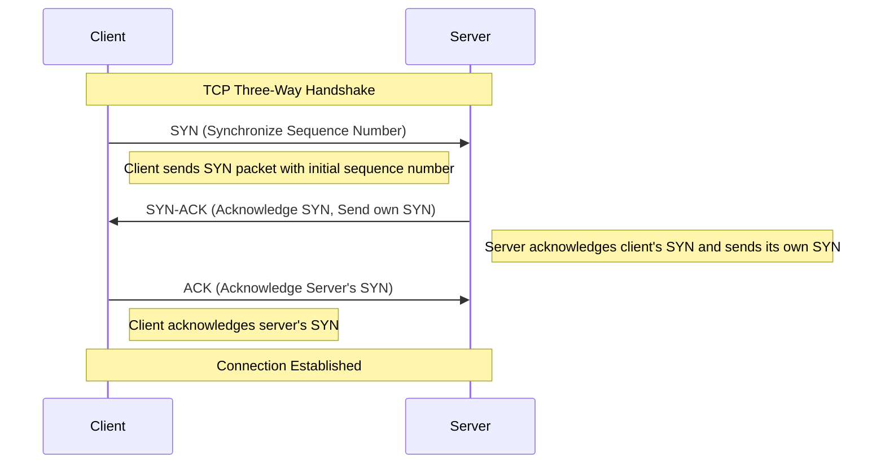

---

### 🔹 UDP (User Datagram Protocol)

**Deep Dive:**
UDP is a connectionless protocol that provides a simple, unreliable datagram service. It doesn't guarantee delivery, ordering, or duplicate protection, making it faster with less overhead than TCP.

**Key Features:**
- Connectionless communication
- Minimal protocol overhead
- No guarantee of delivery
- No congestion control
- Supports broadcasting and multicasting

**UDP Header Structure:**
```
 0      7 8     15 16    23 24    31
+--------+--------+--------+--------+
|     Source      |   Destination   |
|      Port       |      Port       |
+--------+--------+--------+--------+
|                 |                 |
|     Length      |    Checksum     |
+--------+--------+--------+--------+
|                                   |
|              Data                 |
|                                   |
+-----------------------------------+
```

**Diagram – TCP vs UDP Comparison**

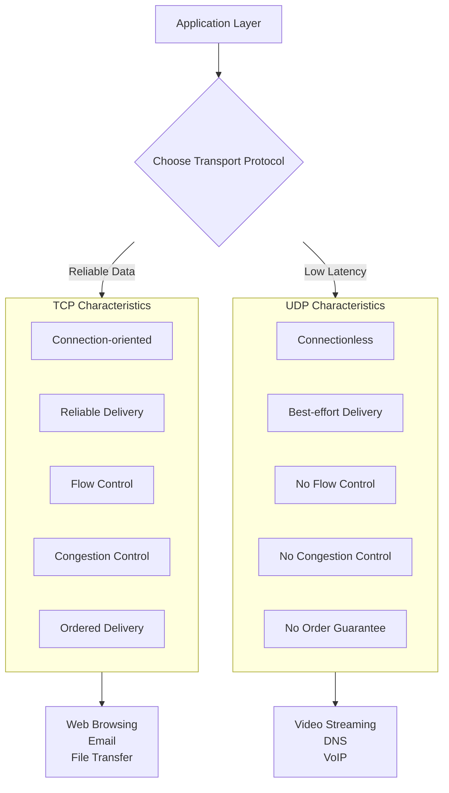

---

### 🔹 ICMP (Internet Control Message Protocol)

**Deep Dive:**
ICMP is used by network devices to send error messages and operational information. It's primarily used for diagnostic purposes and doesn't carry application data.

**Common ICMP Types:**
- Type 0: Echo Reply (ping response)
- Type 3: Destination Unreachable
- Type 5: Redirect Message
- Type 8: Echo Request (ping)
- Type 11: Time Exceeded (used by traceroute)

**ICMP Header Structure:**
```
 0                   1                   2                   3
 0 1 2 3 4 5 6 7 8 9 0 1 2 3 4 5 6 7 8 9 0 1 2 3 4 5 6 7 8 9 0 1
+-+-+-+-+-+-+-+-+-+-+-+-+-+-+-+-+-+-+-+-+-+-+-+-+-+-+-+-+-+-+-+-+
|     Type      |     Code      |          Checksum             |
+-+-+-+-+-+-+-+-+-+-+-+-+-+-+-+-+-+-+-+-+-+-+-+-+-+-+-+-+-+-+-+-+
|                           Contents                            |
+-+-+-+-+-+-+-+-+-+-+-+-+-+-+-+-+-+-+-+-+-+-+-+-+-+-+-+-+-+-+-+-+
```

**Diagram – ICMP Ping Operation**

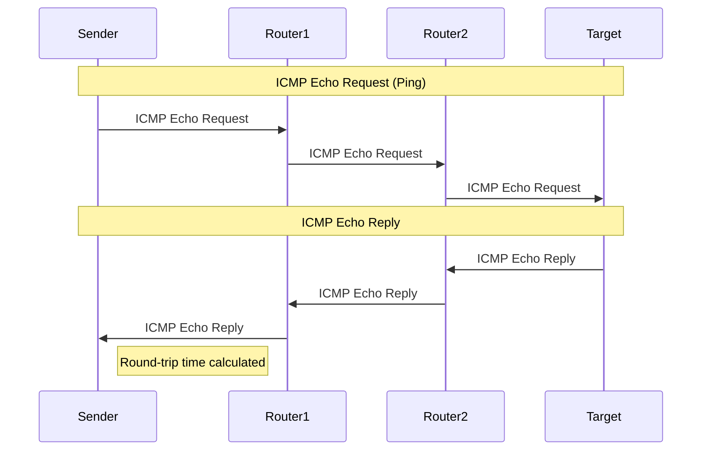

---

### 🔹 DNS (Domain Name System)

**Deep Dive:**
DNS is a hierarchical decentralized naming system that translates human-readable domain names to IP addresses. It uses both UDP (for queries) and TCP (for zone transfers).

**DNS Record Types:**
- A: IPv4 address record
- AAAA: IPv6 address record
- CNAME: Canonical name record (alias)
- MX: Mail exchange record
- NS: Name server record
- TXT: Text record
- SOA: Start of authority record

**DNS Resolution Process:**
1. Check local cache
2. Query recursive resolver
3. Root server referral
4. TLD server referral
5. Authoritative server response

**Diagram – DNS Resolution Process**

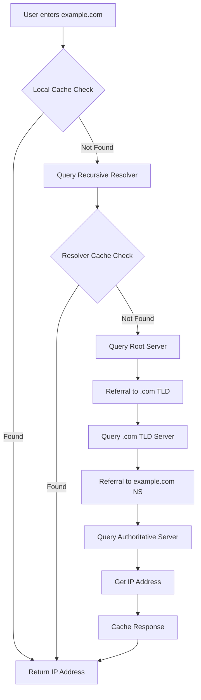

---

### 🔹 DHCP (Dynamic Host Configuration Protocol)

**Deep Dive:**
DHCP automatically assigns IP addresses and other network configuration parameters to devices on a network. It uses a client-server model and the DORA process.

**DHCP Process (DORA):**
1. Discover: Client broadcasts to find DHCP servers
2. Offer: Server responds with an IP offer
3. Request: Client requests the offered IP
4. Acknowledgment: Server confirms the lease

**DHCP Options:**
- IP Address and subnet mask
- Default gateway
- DNS servers
- Lease time
- Domain name

**Diagram – DHCP DORA Process**

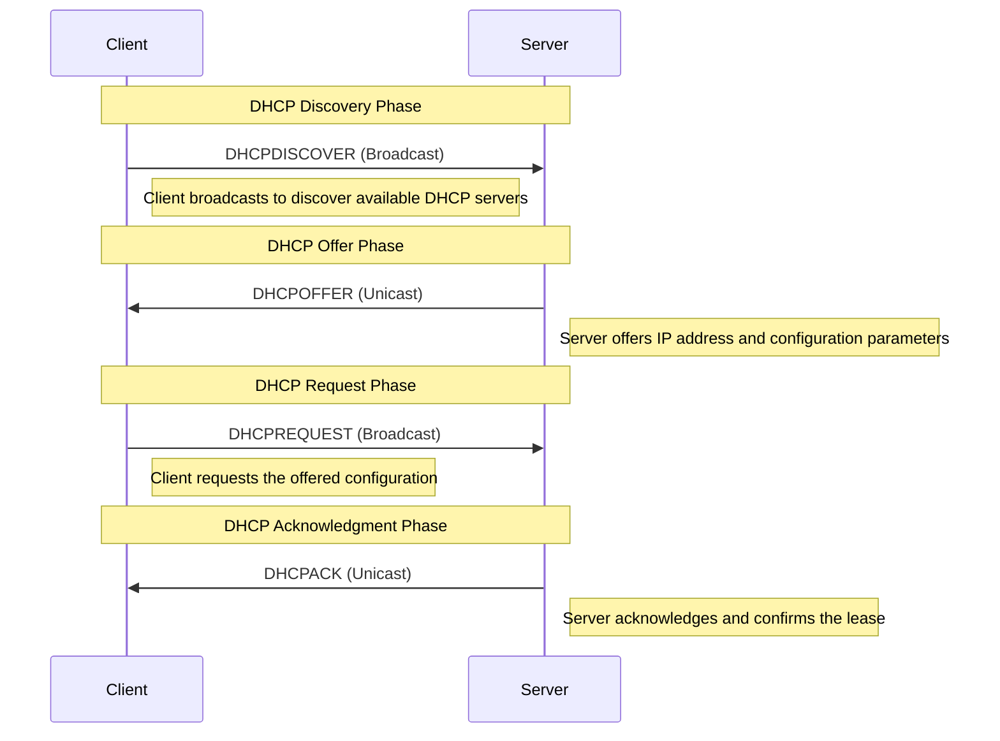

---

### 🔹 HTTP/HTTPS

**Deep Dive:**
HTTP is an application protocol for distributed, collaborative hypermedia information systems. HTTPS is HTTP secured with TLS/SSL encryption.

**HTTP Methods:**
- GET: Retrieve data
- POST: Submit data
- PUT: Replace data
- DELETE: Remove data
- PATCH: Partially update data

**HTTP Status Codes:**
- 1xx: Informational
- 2xx: Success (200 OK, 201 Created)
- 3xx: Redirection (301 Moved Permanently)
- 4xx: Client Error (404 Not Found)
- 5xx: Server Error (500 Internal Server Error)

**HTTPS/TLS Handshake:**
1. Client Hello
2. Server Hello + Certificate
3. Key Exchange
4. Cipher Suite Negotiation
5. Secure Data Transfer

**Diagram – HTTPS/TLS Handshake**

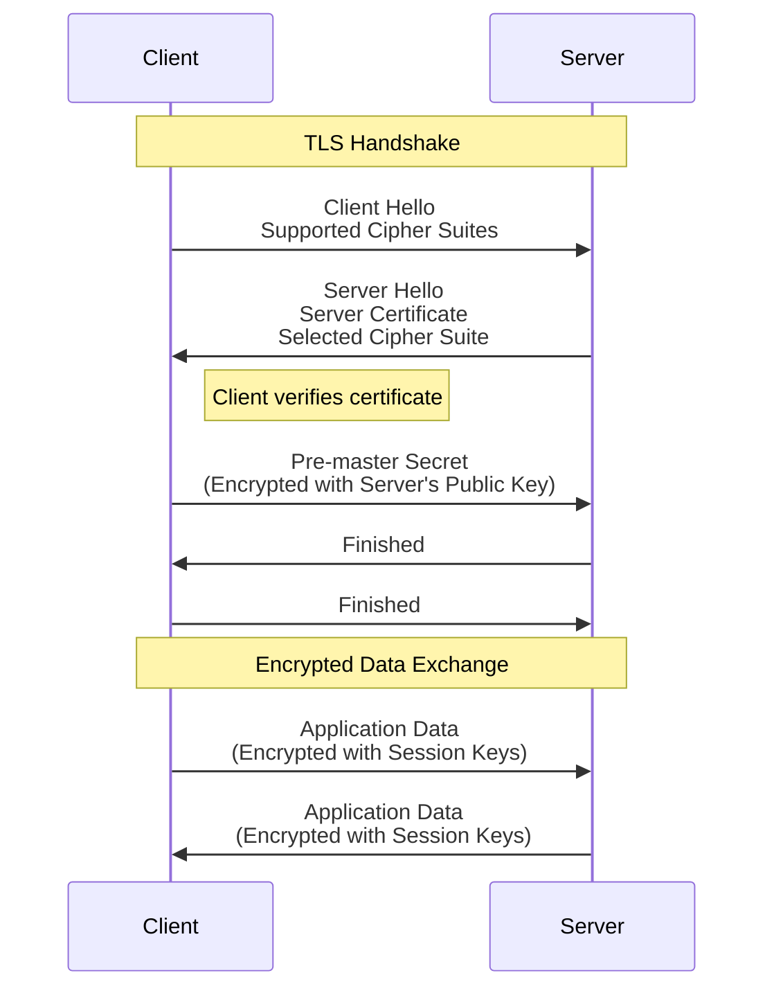

---

## ⚡ Hands-On Challenges with Solutions

---

### 🔹 Scenario 1: TCP vs UDP in Action

**Diagram – TCP Connection Lifecycle**

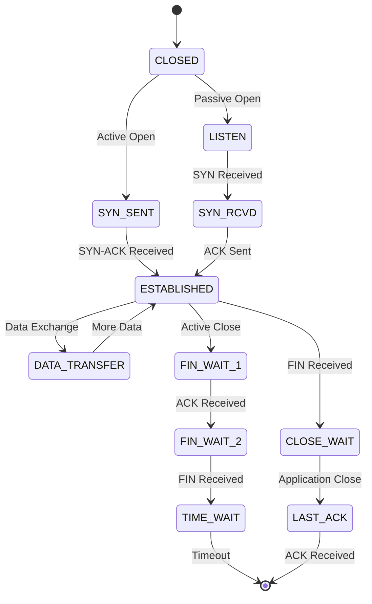

📌 **Task 1: List all services running on TCP and UDP**

```bash
ss -tuln
lsof -i -P -n | grep LISTEN
```

👉 Shows ports like `22/tcp` (SSH), `53/udp` (DNS).

📌 **Task 2: Compare DNS queries (UDP) with HTTP requests (TCP)**

```bash
dig google.com
curl -v http://example.com
```

👉 `dig` uses UDP, while `curl` establishes a TCP handshake.

📌 **Task 3: Simulate packet loss and test**

```bash
sudo tc qdisc add dev eth0 root netem loss 20%
ping google.com
```

👉 Notice TCP retries vs UDP packet loss.

📌 **Task 4: Run throughput test**

```bash
iperf3 -s   # server
iperf3 -c <server-ip> -u -b 10M   # UDP client
iperf3 -c <server-ip>             # TCP client
```

📌 **Task 5: Capture packets**

```bash
sudo tcpdump -i eth0 port 80 or port 53 -nn
```

👉 Watch TCP 3-way handshake vs UDP datagrams.

---

### 🔹 Scenario 2: ICMP (ping & traceroute)

**Diagram – Traceroute Operation**

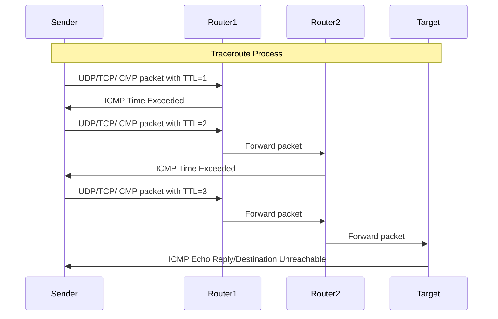

📌 **Task 1: Test reachability**

```bash
ping -c 4 google.com
```

📌 **Task 2: Trace packet path**

```bash
traceroute google.com
# Alternative:
mtr google.com
```

📌 **Task 3: Capture ICMP packets**

```bash
sudo tcpdump -i eth0 icmp
```

📌 **Task 4: Simulate ICMP block**

```bash
sudo iptables -A INPUT -p icmp --icmp-type echo-request -j DROP
ping google.com   # will fail
```

📌 **Task 5: Create monitoring script**

```bash
while true; do
  ping -c1 google.com || echo "ALERT: Host unreachable!"
  sleep 5
done
```

---

### 🔹 Scenario 3: DNS Troubleshooting

**Diagram – DNS Query Types**

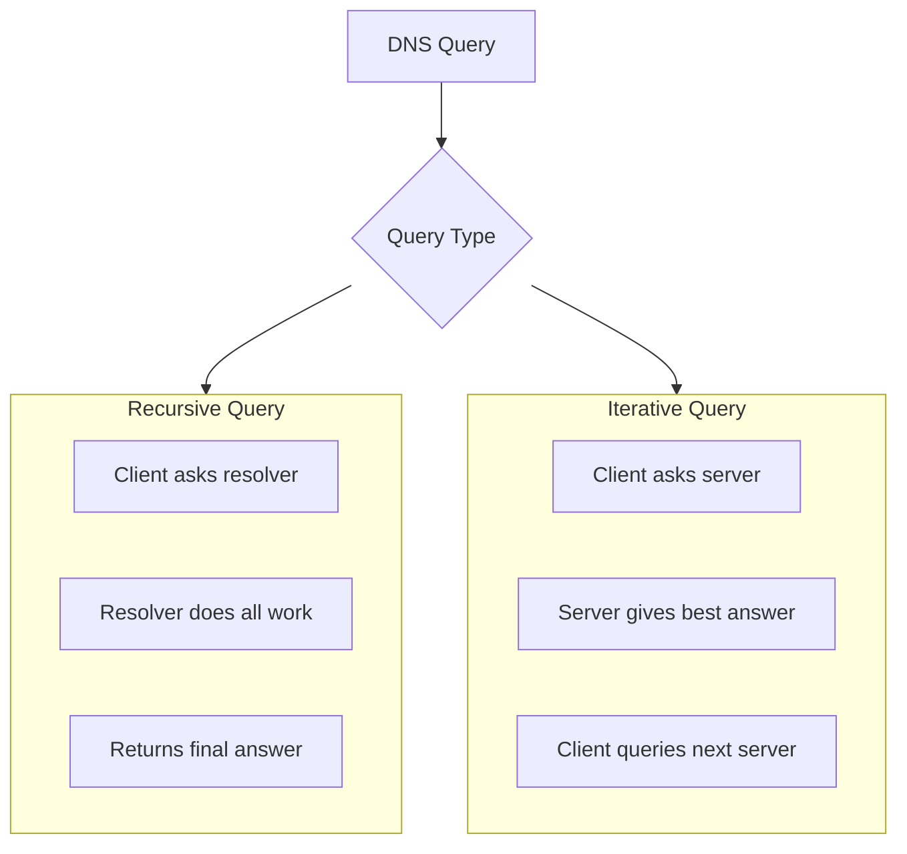

📌 **Task 1: Check DNS config**

```bash
cat /etc/resolv.conf
```

📌 **Task 2: Query DNS**

```bash
dig google.com
nslookup openai.com
```

📌 **Task 3: Configure caching resolver**

```bash
sudo apt install dnsmasq
sudo systemctl enable dnsmasq --now
```

📌 **Task 4: Test DNSSEC**

```bash
dig +dnssec +multi example.com
```

📌 **Task 5: Capture DNS traffic**

```bash
sudo tcpdump -i eth0 port 53
```

---

### 🔹 Scenario 4: DHCP Assignment Issues

**Diagram – DHCP Lease Process**

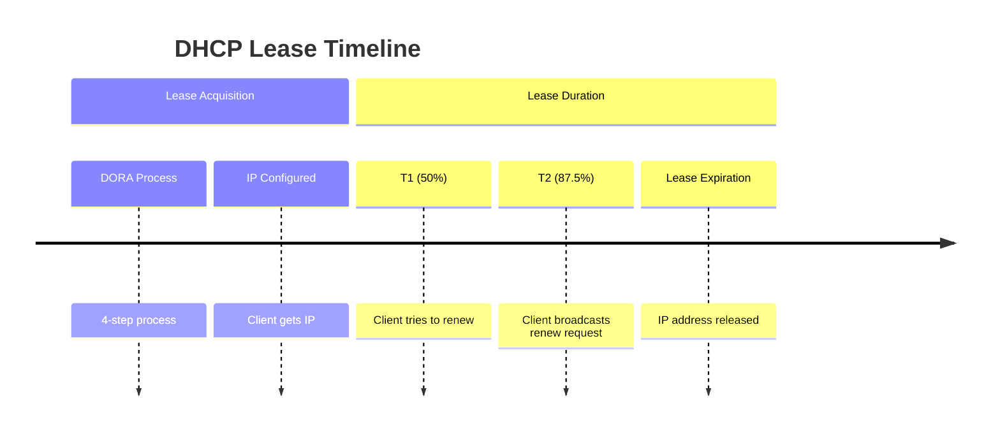

📌 **Task 1: Verify IP lease**

```bash
ip addr show
journalctl -u NetworkManager | grep DHCP
```

📌 **Task 2: Release & renew lease**

```bash
sudo dhclient -r
sudo dhclient
```

📌 **Task 3: Set fallback static IP**

```bash
sudo ip addr add 192.168.1.50/24 dev eth0
```

📌 **Task 4: Simulate DHCP conflict**
Run two DHCP servers → check logs for conflicts.

📌 **Task 5: Capture DHCP handshake**

```bash
sudo tcpdump -i eth0 port 67 or port 68 -n
```

---

### 🔹 Scenario 5: HTTP/HTTPS Debugging

**Diagram – HTTP Request/Response**

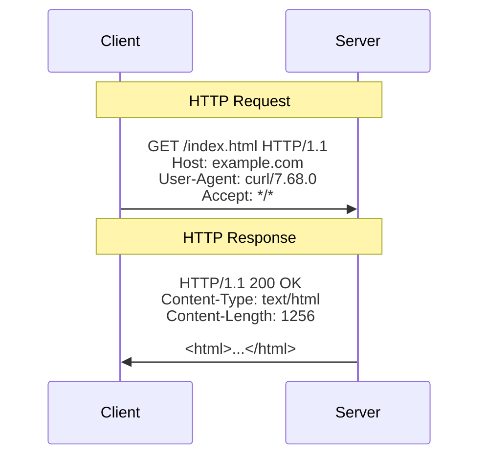

📌 **Task 1: Verify services**

```bash
ss -tuln | grep :80
ss -tuln | grep :443
```

📌 **Task 2: Debug SSL handshake**

```bash
curl -vk https://yoursite.com
openssl s_client -connect example.com:443 -servername example.com
```

📌 **Task 3: Create self-signed cert**

```bash
openssl req -x509 -newkey rsa:2048 -keyout key.pem -out cert.pem -days 365 -nodes
```

📌 **Task 4: Enforce HTTPS**
In Nginx:

```nginx
server {
    listen 80;
    return 301 https://$host$request_uri;
}
```

📌 **Task 5: Simulate MITM**
Install self-signed CA → client warns about untrusted cert.

---

## ✅ Deliverables

* Document everything in `solution.md` with:

  * Commands run
  * Observations
  * Screenshots (optional)
* Push to GitHub & share link
* Post your experience on social media with:
  **#getfitwithsagar #SRELife #DevOpsForAll**

---

## 🌍 Community Links

* **Discord**: [https://discord.gg/mNDm39qB8t](https://discord.gg/mNDm39qB8t)
* **Google Group**: [https://groups.google.com/forum/#!forum/daily-devops-sre-challenge-series/join](https://groups.google.com/forum/#!forum/daily-devops-sre-challenge-series/join)
* **YouTube**: [https://www.youtube.com/@Sagar.Utekar](https://www.youtube.com/@Sagar.Utekar)

---

🔥 With this, you now have **theory + step-by-step solved challenges** for every core protocol!

The detailed Mermaid diagrams visualize each protocol's operation, from TCP handshakes to DNS resolution and HTTPS encryption, making complex networking concepts easier to understand and remember.
