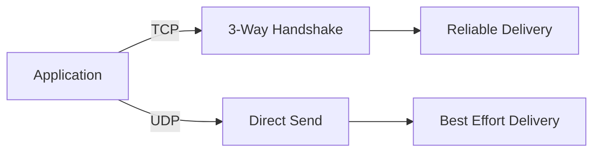

Great 🙌 Let’s build **Day 16 — Core Protocols Challenge** in the **same rich format** as Day 15.
This will include **theory, real-world story, diagrams, and fully solved challenges**.

Here we go 🚀

---

# Day 16 — Core Protocols Challenge (Daily DevOps + SRE Challenge Series — Season 2)

---

## 🌟 Introduction

Welcome to **Day 16** of the Daily DevOps + SRE Challenge Series – Season 2!

Today, we’ll explore the **core networking protocols** that form the backbone of modern infrastructure: **TCP, UDP, ICMP, DNS, DHCP, and HTTP/HTTPS**.

Instead of just learning commands, you’ll solve **real-world production-style problems** where these protocols play a critical role. These hands-on tasks will prepare you to debug outages, secure services, and explain protocol-level behavior in interviews with confidence.

---

## 🚀 Why Does This Matter?

* **TCP vs UDP:** Choosing the right transport protocol affects performance, reliability, and scalability.
* **ICMP:** Quickest way to test connectivity, routing, and latency issues.
* **DNS:** One of the biggest causes of outages in real-world systems.
* **DHCP:** Critical for dynamic IP management in data centers and cloud.
* **HTTP/HTTPS:** The face of almost every service, where security and performance meet.

---

## 🔥 Real-World Save

* A fintech company once experienced **timeouts on payment APIs**. Root cause: firewall blocked **TCP port 443**.
* A streaming platform suffered **video buffering**. Root cause: packet loss showed TCP retries, but UDP-based CDN solved it.
* A global e-commerce site went down for **4 hours** because of a **DNS misconfiguration**.
* A new VM farm booted up without IPs because of a **rogue DHCP server** in the subnet.
* A startup got flagged for **“insecure website”** by Google Chrome due to expired SSL.

You’ll now walk through these scenarios step by step.

---

## 📘 Theory Section

### 🔹 TCP vs UDP

* **TCP (Transmission Control Protocol):** Reliable, connection-oriented, ensures ordered delivery (e.g., banking, APIs).
* **UDP (User Datagram Protocol):** Faster, connectionless, no guarantee (e.g., video streaming, DNS).

**Diagram – TCP vs UDP**



---

### 🔹 ICMP

* Used for **ping** (reachability) and **traceroute** (path discovery).
* Not for data transfer, just diagnostics.

---

### 🔹 DNS

* Resolves human-friendly names (`example.com`) into IPs (`93.184.216.34`).
* Works on **UDP 53** (queries), sometimes **TCP 53** (zone transfers).

---

### 🔹 DHCP

* Assigns IP dynamically:
  **DORA → Discover → Offer → Request → Ack**

---

### 🔹 HTTP/HTTPS

* HTTP (80): Plain text, insecure.
* HTTPS (443): Encrypted with TLS/SSL.
* Certificates validate server identity.

---

## ⚡ Hands-On Challenges with Solutions

---

### 🔹 Scenario 1: TCP vs UDP in Action

📌 **Task 1: List all services running on TCP and UDP**

```bash
ss -tuln
lsof -i -P -n | grep LISTEN
```

👉 Shows ports like `22/tcp` (SSH), `53/udp` (DNS).

📌 **Task 2: Compare DNS queries (UDP) with HTTP requests (TCP)**

```bash
dig google.com
curl -v http://example.com
```

👉 `dig` uses UDP, while `curl` establishes a TCP handshake.

📌 **Task 3: Simulate packet loss and test**

```bash
sudo tc qdisc add dev eth0 root netem loss 20%
ping google.com
```

👉 Notice TCP retries vs UDP packet loss.

📌 **Task 4: Run throughput test**

```bash
iperf3 -s   # server
iperf3 -c <server-ip> -u -b 10M   # UDP client
iperf3 -c <server-ip>             # TCP client
```

📌 **Task 5: Capture packets**

```bash
sudo tcpdump -i eth0 port 80 or port 53 -nn
```

👉 Watch TCP 3-way handshake vs UDP datagrams.

---

### 🔹 Scenario 2: ICMP (ping & traceroute)

📌 **Task 1: Test reachability**

```bash
ping -c 4 google.com
```

📌 **Task 2: Trace packet path**

```bash
traceroute google.com
```

📌 **Task 3: Capture ICMP packets**

```bash
sudo tcpdump -i eth0 icmp
```

📌 **Task 4: Simulate ICMP block**

```bash
sudo iptables -A INPUT -p icmp --icmp-type echo-request -j DROP
ping google.com   # will fail
```

📌 **Task 5: Create monitoring script**

```bash
while true; do
  ping -c1 google.com || echo "ALERT: Host unreachable!"
  sleep 5
done
```

---

### 🔹 Scenario 3: DNS Troubleshooting

📌 **Task 1: Check DNS config**

```bash
cat /etc/resolv.conf
```

📌 **Task 2: Query DNS**

```bash
dig google.com
nslookup openai.com
```

📌 **Task 3: Configure caching resolver**

```bash
sudo apt install dnsmasq
sudo systemctl enable dnsmasq --now
```

📌 **Task 4: Test DNSSEC**

```bash
dig +dnssec +multi example.com
```

📌 **Task 5: Capture DNS traffic**

```bash
sudo tcpdump -i eth0 port 53
```

---

### 🔹 Scenario 4: DHCP Assignment Issues

📌 **Task 1: Verify IP lease**

```bash
ip addr show
journalctl -u NetworkManager | grep DHCP
```

📌 **Task 2: Release & renew lease**

```bash
sudo dhclient -r
sudo dhclient
```

📌 **Task 3: Set fallback static IP**

```bash
sudo ip addr add 192.168.1.50/24 dev eth0
```

📌 **Task 4: Simulate DHCP conflict**
Run two DHCP servers → check logs for conflicts.

📌 **Task 5: Capture DHCP handshake**

```bash
sudo tcpdump -i eth0 port 67 or port 68 -n
```

---

### 🔹 Scenario 5: HTTP/HTTPS Debugging

📌 **Task 1: Verify services**

```bash
ss -tuln | grep :80
ss -tuln | grep :443
```

📌 **Task 2: Debug SSL handshake**

```bash
curl -vk https://yoursite.com
```

📌 **Task 3: Create self-signed cert**

```bash
openssl req -x509 -newkey rsa:2048 -keyout key.pem -out cert.pem -days 365 -nodes
```

📌 **Task 4: Enforce HTTPS**
In Nginx:

```nginx
server {
    listen 80;
    return 301 https://$host$request_uri;
}
```

📌 **Task 5: Simulate MITM**
Install self-signed CA → client warns about untrusted cert.

---

## ✅ Deliverables

* Document everything in `solution.md` with:

  * Commands run
  * Observations
  * Screenshots (optional)
* Push to GitHub & share link
* Post your experience on social media with:
  **#getfitwithsagar #SRELife #DevOpsForAll**

---

## 🌍 Community Links

* **Discord**: [https://discord.gg/mNDm39qB8t](https://discord.gg/mNDm39qB8t)
* **Google Group**: [https://groups.google.com/forum/#!forum/daily-devops-sre-challenge-series/join](https://groups.google.com/forum/#!forum/daily-devops-sre-challenge-series/join)
* **YouTube**: [https://www.youtube.com/@Sagar.Utekar](https://www.youtube.com/@Sagar.Utekar)

---

🔥 With this, you now have **theory + step-by-step solved challenges** for every core protocol!

Do you also want me to make **Mermaid sequence diagrams** for each protocol (like TCP handshake, DNS resolution, DHCP DORA, HTTPS handshake) so it becomes even more visual for learners?
